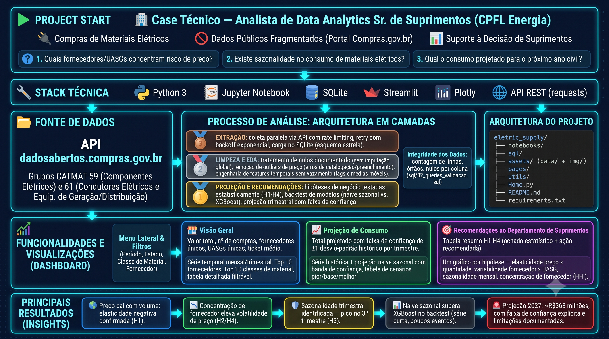

# ⚡ Materiais Elétricos — Compras Públicas | Analytics de Suprimentos

Dashboard analítico e pipeline de dados sobre compras públicas de materiais elétricos, construído para apoiar decisões da área de Suprimentos de uma empresa do setor elétrico.


⚠️ O app pode levar ~30s para inicializar se estiver inativo.

Link para o projeto: https://eletricsupply.streamlit.app

<p align="center">

</p>

### 🎯 Destaques
- Construí um pipeline completo — extração via API pública, banco relacional em esquema estrela e dashboard de 3 abas — sobre **164.680 registros** de compras públicas de materiais elétricos (2021–2026), dando à área de Suprimentos autoatendimento analítico em minutos.
- Validei **4 hipóteses de negócio** com testes não-paramétricos, incluindo um achado contra-intuitivo: itens de consumo irregular têm maior, não menor, concentração de fornecedor (ρ=-0,458, p≈4,5e-205) — um proxy real de risco de ruptura de suprimento.
- Comparei métodos de projeção de consumo em backtest real contra dados de 2026: o método mais simples (naive sazonal) venceu o XGBoost com folga (**MAPE 18,7% vs. 81,0%**), reforçando a escolha pela navalha de Occam — zero parâmetros ajustados e mais robusto com pouco histórico de treino.
- Segmentei a série de projeção em capex (compra concentrada de equipamento pesado, preço unitário > R$500 mil) e opex (consumo recorrente): 17,8% do valor da base vinha de só 50 transações (0,03%), 90% do valor em 2 trimestres — misturar os dois na mesma série mascarava o padrão real. Capex virou caracterização histórica, não projeção numérica; opex ficou com uma faixa de confiança 2x mais estreita e defensável.

---

## 🚨 Problema de Negócio

A área de Suprimentos de uma empresa do setor elétrico compra materiais elétricos (transformadores, cabos, disjuntores, chaves, isoladores, ferragens) de forma recorrente através de licitações públicas registradas no Compras.gov.br.

Até então, essas decisões não tinham uma leitura consolidada do histórico de mercado — sem visibilidade clara sobre padrões de preço, variabilidade e risco de dependência de fornecedor.

**Pergunta central:** Que padrões, tendências e riscos existem nas compras públicas de materiais elétricos, e quanto a área deve esperar gastar no próximo ano?

**Minha tarefa:** construir sozinho o pipeline completo — da extração de dados via API até o dashboard final — formular e testar hipóteses de negócio, projetar consumo para o ano seguinte com metodologia e limitações explícitas, e traduzir tudo isso em recomendações acionáveis para Suprimentos.

---

## 🗺️ Planejamento da Solução

A solução foi estruturada seguindo a metodologia **CRISP-DS**, em 3 notebooks sequenciais seguidos de um dashboard interativo:

1. **Extração e carga** — validação isolada da API, depois coleta paralela com rate limiter (thread-safe) e retry com backoff exponencial, escrita num banco SQLite em esquema estrela, com lógica de retomada de coleta interrompida.

2. **Tratamento e padronização** — tipagem corrigida, deduplicação de fornecedor por CNPJ, tratamento de nulos sem imputação global (decisão deliberada, documentada por coluna).

3. **Análise exploratória e hipóteses de negócio** — univariada, bivariada e multivariada; testes não-paramétricos (curtose ≈ 20.816 nos dados de preço/quantidade inviabiliza métodos paramétricos); validação de 4 hipóteses (H1–H4).

4. **Projeção de consumo** — diagnóstico de volatilidade por granularidade (mensal descartada, trimestral adotada), backtest comparando 6 métodos de projeção contra dados reais de 2026.

5. **Construção do dashboard** — aplicação Streamlit multi-página com filtros por período, estado, classe CATMAT e fornecedor, KPIs, série temporal, rankings, projeção e recomendações consolidadas.

**Ferramentas:** Python (Pandas, NumPy, SciPy, statsmodels, scikit-learn, XGBoost), SQLite, Streamlit, Plotly. Código escrito com apoio do Claude Code; definição das hipóteses, testes estatísticos e interpretação dos resultados são autorais.

---

## 🛠️ Desenvolvimento

### Dataset

| Atributo | Detalhe |
|---|---|
| Fonte | API do Portal de Dados Abertos — `dadosabertos.compras.gov.br` |
| Escopo | Grupos CATMAT 59 e 61 — 7 classes de materiais elétricos |
| Granularidade | 1 linha = 1 item comprado (preço praticado) |
| Integridade | Verificação de nulos por coluna, deduplicação de fornecedor por CNPJ, validação cruzada contra o banco (contagem de linhas, chave única, amostragem) |

### Abas do Dashboard

1. **Visão Geral**
- Focada em consumo agregado, evolução temporal e os principais fornecedores e classes de material.
- Métricas Chave: Valor total, nº de compras, fornecedores únicos, UASGs únicas, ticket médio.
- Gráficos: Série temporal (mensal/trimestral), Top 10 fornecedores por valor, Top 10 classes, tabela detalhada filtrável por período/estado/classe/fornecedor.

2. **Projeção de Consumo**
- Focada no cenário de gasto esperado para o próximo ano civil, com a incerteza sempre visível — e na distinção entre o que dá pra projetar (opex) e o que não dá (capex).
- Métricas Chave: Total de opex projetado (≈R$ 361,4 milhões para 2027), faixa de confiança de ±1 desvio padrão histórico por trimestre; capex caracterizado à parte (histórico, sem projeção numérica).
- Gráficos: Série histórica + projeção naive sazonal com banda de confiança, tabela de cenários (pior/base/melhor) por trimestre, gráfico de capex histórico por trimestre e tabela de principais compradores.

3. **Recomendações ao Departamento de Suprimentos**
- Síntese executiva que consolida as 4 hipóteses de negócio validadas em ação recomendada.
- Métricas Chave: tabela-resumo H1–H4 (achado estatístico + recomendação de ação).
- Gráficos: um gráfico de apoio por hipótese — elasticidade preço x quantidade (H1), variabilidade por fornecedor x UASG (H2), sazonalidade mensal (H3), regularidade x concentração de fornecedor/HHI (H4).

### Métodos de Projeção Avaliados (opex)

| Método | Complexidade | MAPE (backtest 2026) |
|---|---|---|
| **Naive Sazonal ✅** | 0 parâmetros | 18,7% |
| XGBoost | 50 árvores | 81,0% |
| Holt-Winters* | 3 parâmetros | 14,6% |
| Média simples* | 0 parâmetros | 22,6% |
| Naive não-sazonal* | 0 parâmetros | 28,9% |
| Média móvel (4 trimestres)* | 0 parâmetros | 46,3% |

\* Testados informalmente fora deste backtest, antes da limpeza de outliers de catalogação, da exclusão do trimestre inicial incompleto e da segmentação capex/opex aplicadas posteriormente à base — não foram recalculados, tratar como referência aproximada.

O naive sazonal (repete o valor do mesmo trimestre do ano anterior) venceu o XGBoost com folga — 62,3 p.p. de MAPE. Com um histórico de treino pequeno (12 trimestres), qualquer modelo que precise "aprender" sofre mais do que um baseline que só repete o padrão sazonal observado; a navalha de Occam decide: entre modelos com essa diferença de robustez, o mais simples e interpretável.

A granularidade e a composição da série também foram decididas por evidência, não por padrão: agregação mensal foi descartada (CV=0,85, piora ligeiramente para 0,86 removendo outliers de preço/quantidade por item — esse filtro não captura a causa real da volatilidade) em favor da agregação trimestral. A causa real da volatilidade dos trimestres mais antigos não era outlier estatístico — era um processo de demanda diferente misturado na mesma série: compra concentrada de equipamento pesado de subestação (capex) por 2-3 grandes UASGs, que não segue padrão sazonal. Separei capex de opex (critério: preço unitário > R$500 mil) e excluí o trimestre inicial incompleto antes de agregar — a série de opex resultante tem CV=0,28, robusta o bastante para um backtest e uma faixa de confiança confiáveis.

### Estrutura do Projeto

```text
eletric_supply/
├── assets/             # Banco de dados SQLite (esquema estrela) e imagens usadas no dashboard/README
├── notebooks/          # 01 validação da API · 02 extração e carga no banco · 03 limpeza, EDA e projeção
├── sql/                # Script de criação do schema e queries de validação (contagem, órfãos, nulos)
├── pages/              # Página secundária do dashboard Streamlit (Dashboard)
├── utils/              # Reservado para módulo compartilhado (config, conexão com o banco)
├── .gitignore          # Arquivos e pastas ignorados pelo Git
├── Home.py             # Ponto de entrada do dashboard Streamlit (resumo do projeto e navegação)
├── LICENSE             # Licença MIT do projeto
├── README.md           # Documentação principal do projeto
└── requirements.txt    # Lista de bibliotecas Python necessárias
```

### Como Executar Localmente

```bash
git clone https://github.com/guigrandim/eletric_supply.git
cd eletric_supply
pip install -r requirements.txt
streamlit run Home.py
```

> O banco `assets/data/database.db` já está versionado no repositório — a aplicação roda direto, sem precisar re-executar os notebooks de extração. Para regenerar os dados do zero (ex. período mais recente), rode `notebooks/01` e `notebooks/02` nesta ordem.

---

## 💡 Top Insights

### 1. 📉 Comprar mais reduz o preço unitário — economia de escala confirmada

**H1 confirmada** — regressão log-log entre quantidade e preço unitário mostra relação negativa robusta (slope=-0,487, r²=0,274, p<0,001, n=153.598). Suprimentos pode usar isso de forma direta: consolidar compras de itens recorrentes entre UASGs via atas compartilhadas gera ganho de escala mensurável.

---

### 2. 🏭 A variabilidade de preço está mais ligada ao fornecedor do que à unidade compradora — mas o efeito é pequeno

**H2 confirmada, efeito pequeno** — o coeficiente de variação de preço é maior entre fornecedores (mediana 0,260) do que entre UASGs (mediana 0,243), diferença estatisticamente significativa (p=0,0107) mas de baixa magnitude. Direciona esforço de negociação para o fornecedor, mas não justifica uma reestruturação de compras baseada só nesse achado.

---

### 3. 📅 A quantidade comprada varia fortemente ao longo do ano — o preço, não

**H3 parcialmente confirmada** — a quantidade comprada por mês varia de forma fortemente significativa (Kruskal-Wallis H=708,8, p≈7,1e-145), concentrada no início do ano civil. Já a sazonalidade de preço, embora estatisticamente significativa, não tem um padrão prático interpretável — decisão consciente de não superinterpretar esse segundo resultado.

---

### 4. ⚠️ Itens comprados de forma irregular têm MAIS dependência de fornecedor, não menos

**H4 confirmada, contra-intuitivo** — usando um índice de regularidade de consumo (monotonia = média/desvio padrão do gasto mensal, conceito adaptado da Ciência do Esporte) cruzado com o Herfindahl-Hirschman Index (HHI) de concentração de fornecedor por item, encontrei correlação negativa forte (ρ=-0,458, p≈4,5e-205, n=3.970): quanto mais esporádica e imprevisível a compra de um item, maior a concentração em poucos fornecedores dispostos a atendê-la. Vira recomendação direta de qualificar fornecedores alternativos para esses itens.

---

## 📊 Resultados

### Resultado da Entrega

O dashboard substituiu a consulta manual e pontual ao histórico de compras por um painel de autoatendimento: a área de Suprimentos passa a filtrar por período, estado, classe CATMAT e fornecedor, ver KPIs e rankings em segundos, e consultar uma síntese executiva com as 4 hipóteses validadas — achado, recomendação e gráfico de apoio — sem depender de leitura do notebook técnico a cada decisão.

<p align="center">

</p>

### Projeção de Consumo — Ano Civil de 2027

Método de produção: naive sazonal sobre a série de opex (consumo recorrente), com faixa de confiança heurística de ±1 desvio padrão histórico (≈ R$ 23,3 milhões por trimestre).

| Trimestre | Opex projetado |
|---|---|
| Jan–Mar/27 | R$ 70,3 milhões |
| Abr–Jun/27 | R$ 69,5 milhões |
| Jul–Set/27 | R$ 137,1 milhões |
| Out–Dez/27 | R$ 84,5 milhões |
| **Total opex 2027** | **≈ R$ 361,4 milhões** |

**Capex (equipamento pesado) não entra nesse total.** É caracterizado à parte: R$335,7 milhões observados entre nov/2021 e jul/2026, 90% concentrados em só 2 trimestres (2021-Q4 e 2022-Q1), dominados por 3 UASGs (EPE, FURNAS, Eletronorte). Sem periodicidade nem tendência, não é projetável de forma responsável com o histórico disponível — a recomendação é orçá-lo por pipeline de projeto/licitação conhecida, não por extrapolação de série temporal.

---

## ✅ Conclusões

A solução cobre o ciclo completo de um projeto de analytics aplicado a Suprimentos — extração via API, tratamento e estruturação em banco relacional, EDA com hipóteses testadas estatisticamente, projeção de consumo com metodologia e limitações explícitas, dashboard interativo e recomendações ancoradas em achados específicos, sem extrapolação além do que os dados suportam.

**Próximos passos:**
- Reavaliar a escolha do método de projeção (naive sazonal vs. Holt-Winters vs. XGBoost) a cada novo trimestre real disponível.
- Projetar por classe/grupo CATMAT, não só no agregado do portfólio.
- Extrair a lógica duplicada de cálculo (CV, HHI, elasticidade) entre notebook e dashboard para um módulo compartilhado em `utils/`.
- Migrar `database.db` para Git LFS ou storage externo (hoje versionado diretamente no repositório).

**Limitações:**
- Backtest da projeção usou apenas 2 trimestres reais de 2026 — MAPE tem alta variância com tão poucos pontos
- Amostra de treino pequena (12 trimestres) penaliza modelos de ML mais complexos frente a baselines simples
- Faixa de confiança é heurística (±1 desvio padrão), não um intervalo de predição estatístico formal
- Capex não recebe projeção numérica (decisão deliberada) — com só 2 eventos grandes em 4,6 anos de dados, qualquer projeção teria margem de erro maior que o valor projetado
- Projeção de opex não incorpora eventos futuros conhecidos (reajustes contratuais, novas licitações de grande porte, câmbio para itens importados)

---

*📊 Dados: Portal de Dados Abertos, Compras.gov.br (CATMAT 59 e 61) · 🗓️ 2021–2026 · 🧮 CRISP-DS · 📈 Streamlit + Plotly*

## 🧰 Skills Demonstradas

- Engenharia de dados: extração via API com rate limiting e retry, banco relacional em esquema estrela, pipeline resumível.
- Estatística aplicada: testes não-paramétricos (Mann-Whitney, Kruskal-Wallis, Spearman) justificados por diagnóstico de curtose/assimetria, em vez de aplicar testes paramétricos por padrão.
- Séries temporais: diagnóstico de granularidade por coeficiente de variação, backtest comparando 6 métodos de projeção, feature engineering sem vazamento temporal.
- Visualização de dados: dashboard Streamlit multi-página com filtros, KPIs e projeção interativa.
- Comunicação executiva: tradução de 4 hipóteses estatísticas em recomendações acionáveis para Suprimentos, com transparência sobre efeitos pequenos vs. grandes.

## 👩‍💻 Autor

Desenvolvido por Guilherme Grandim como um projeto de portfólio em Ciências/Análise de Dados.
Comentários e sugestões sobre o projeto são bem-vindos.
Linkedin: [🔗](https://www.linkedin.com/in/guilherme-grandim/)
Gmail: [📧](mailto:gui.grandim@gmail.com)

## 📄 Licença

Este projeto está sob a licença MIT — veja [LICENSE](./LICENSE) para detalhes.
